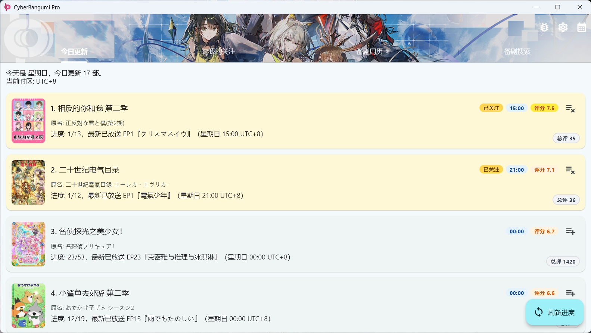
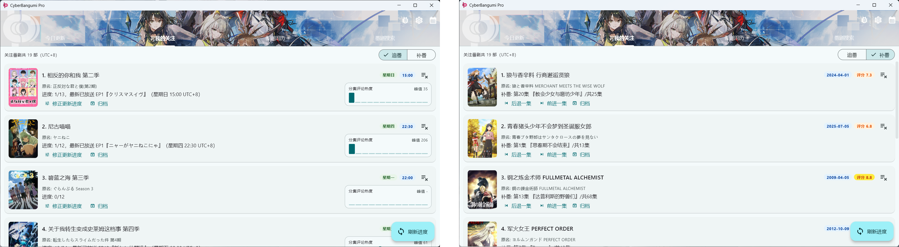
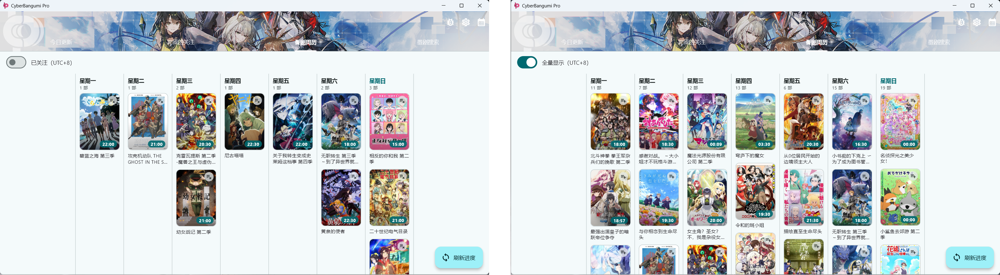
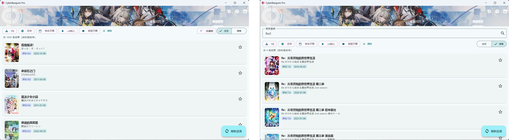
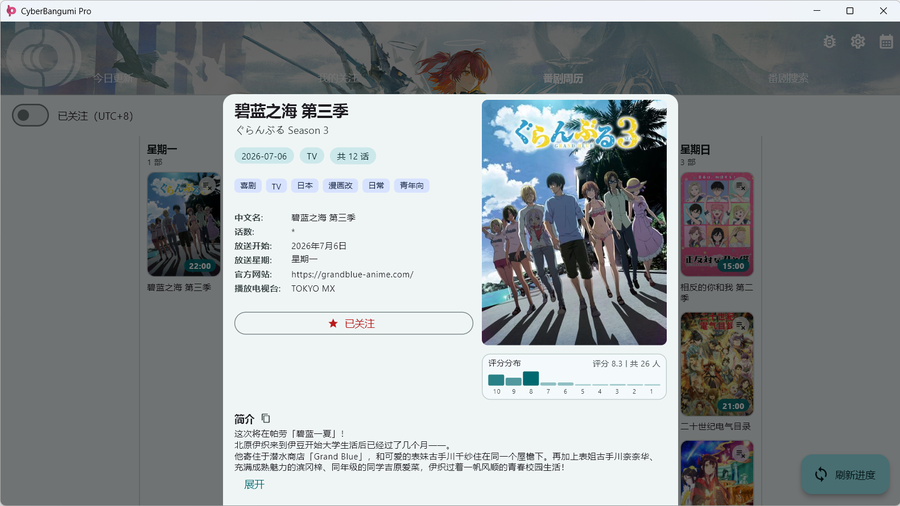

CyberBangumi Pro 是一个基于 Flutter 的 Windows 桌面端番剧日历与追番辅助工具。

- 自动抓取当季番剧日历，支持时区转换
- 番剧搜索与条目详情查看
- 管理关注列表并刷新放送进度
- 内建代理，解决 Bangumi API 网络可达性问题

## 界面

四个主标签页：
### 1.**今日更新** — 当天放送番剧，快速关注/取消关注



### 2.**我的关注** — 已关注番剧及进度，支持手动修正。分为两个子模式：
  - **追番** — 当季正在播出的番剧，按最近有更新的排在前
  - **补番** — 已完结的番剧，支持手动前进/后退集数，按最近修改补番进度的时间排序（延迟生效）



### 3.**番剧周历** — 按星期查看放送分布



### 4.**番剧搜索** — 搜索条目，分页翻页。支持两个模式：
  - **搜索模式** — 输入关键词搜索，默认按收藏人数排序。支持多维过滤器。
  - **浏览模式** — 隐藏搜索框，一次展示全部条目，配合多维过滤器（分类、地区、播出年份、最低评分、评分人数、标签）和排序（收藏数/评分）实现榜单浏览。


### 5.点击任意封面弹出详情面板，包含评分分布、制作信息、剧情简介、关注按钮等。




## 主要功能

- **日历抓取** — 聚合 bgmlist.com archive 与 OnAir 双数据源，自动缓存
- **进度追踪** — 基于 Bangumi API 拉取分集进度，支持并发批量刷新
- **内建代理** — 集成 Clash (mihomo) 核心，支持订阅链接，自动测速选优
- **封面缓存** — 封面走代理下载到本地后显示，浏览更流畅
- **调试工具** — 日志窗口、调试星期、调试归档
- **时区转换** — 默认 UTC+8，可在设置中调整

## 数据来源

- [Bangumi API](https://api.bgm.tv)
- [BGMLIST Archive / OnAir](https://bgmlist.com)

## 运行

```bash
flutter pub get
flutter run -d windows
```

Release 构建：`powershell -File build_release.ps1`，输出到 `release/` 目录。

## 项目结构

```
lib/
├── main.dart
├── clash_manager.dart
├── constants.dart
├── models/
├── services/
└── stores/
```

<div align=center>

</div>
